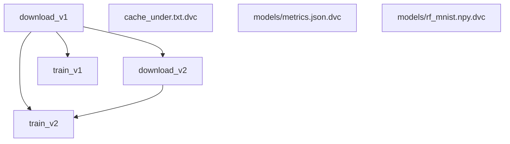

# MNIST Practice with DVC(Data Version Control)


## Install DVC
Follow this doc: https://dvc.org/doc/start
Recommend using Python version 3.10-3.11
Install requirements packages:
```bash
pip install -r requirements.txt
```

## Add data version 1
### Download MNIST Dateset
The data will saving as [standard binary file format](https://github.com/numpy/numpy/blob/067cb067cb17a20422e51da908920a4fbb3ab851/doc/neps/nep-0001-npy-format.rst). We can use other format like parquet to optimize the storage
```bash
python ./scripts/download_asset_v1.py
```
### DVC init and add data
```bash
dvc init
dvc add data/raw/mnist_x_train_v1.npy
```

Add meta data in `npy.dvc` file to track the data version.
Git only save the hash of the data(metadata in .dvc file), not the data itself.
```
meta:
  version: v1.0
  date: 10/04/2025
  author: banhmuy
  description: MNIST dataset version 1
```

Add `cache_under.txt` by dvc
```bash
data add cache_under.txt
```

Try to change `cache_under.txt` and run `dvc status` to see the change. Run `dvc add cache_under.txt` to update the cache.
It save another hash for this  in `cache_under.txt.dvc` file and when pushing, it will push cache version

Push the last files in MNIST dataset to remote storage
```bash
dvc add data/raw/mnist_y_train_v1.npy
dvc add data/raw/mnist_x_test_v1.npy
dvc add data/raw/mnist_y_test_v1.npy
```

Git add and commit the `.dvc` files. It will push the `.npy.dvc` containing the meta data and hash of the data, ignore the `.npy` files.
It can download the data(Cache will store in cloud) from remote storage by `dvc pull` command.

There is a connection between the dvc version with git version.

Add the train file to train data

## Train the model and how to pull the data storage
Goto `data/raw`
Symbolic link for data:
```bash
mklink x_train.npy x_train_v1.npy
```
For Linux/WSL:
```bash
ln -s mnist_x_train_v1.npy mnist_x_train.npy
ln -s mnist_y_train_v1.npy mnist_y_train.npy
ln -s mnist_x_test_v1.npy mnist_x_test.npy
ln -s mnist_y_test_v1.npy mnist_y_test.npy
```
Run train.py to train the model and save the model and metrics.
Run dvc add to add the model and metrics to dvc.
```bash
dvc add models/rf_mnist.npy
dvc add models/metrics.json
```
Create local storage contain the data cache:
```bash
mkdir ../dvc_storage

dvc remote add -d local ../dvc_storage
```
Remove local stograge if already exist:
```bash
dvc remote remove local
```
When you want to pull the dvc storage to your local machine, create a folder with the same level as git folder and run:
```bash
dvc remote add -d local ../your_dvc_storage
dvc pull
```
## Add data version 2
Create new data version 2 and add it to dvc.
```bash
dvc add data/raw/mnist_x_train_v2.npy
dvc add data/raw/mnist_y_train_v2.npy
```

DVC have no version, it bases on git to track the version of the data. DVC itself does not reinvent the version control system. Instead, it is designed to extend Git to handle large files, data, and models.

Create new symbol link to the new data version 2 and retrain the model.
```bash
cd data/raw
rm mnist_x_train.npy mnist_y_train.npy

# Create new
ln -s mnist_x_train_v2.npy mnist_x_train.npy
ln -s mnist_y_train_v2.npy mnist_y_train.npy

cd ../..

# Retrain model
python scripts/train.py

# dvc v2
dvc add models/metrics.json
dvc add models/rf_mnist.npy
```

### Rollback to the Data version 1
First git checkout to the commit that you want to rollback to, then dvc checkout the corresponding data version of that commit.
```bash
git checkout <commit_id>
dvc checkout
```

### Some common DVC commands
- `dvc list .`:the files in the current repository:
- `dvc status`: show the status of the files in the current repository
- `dvc pull`: pull the data from the remote storage to the local machine
- `dvc add <file>`: add a file to the DVC repository
- `dvc checkout`: checkout the data to the specified version
- `dvc push`: push the data to the remote storage
- `dvc dag`: view pipeline graph
- `dvc repro <train_branch>`: run the correct branch
- `dvc metrics show`: view, compare metrics
- `dvc remote list -v`: Show current remote list

### Set up DVC artifacts
- Declare an artifacts in dvc.yaml:
```bash
# dvc.yaml
stages:
  download_v1:
    cmd: python scripts/download_asset_v1.py
    deps:
      - scripts/download_asset_v1.py
    outs:
      - data/raw/mnist_x_train_v1.npy
      - data/raw/mnist_y_train_v1.npy
      - data/raw/mnist_x_test.npy
      - data/raw/mnist_y_test.npy
```
Explain:
- `deps`: logic input (file/script) for DVC to hash. Change them → “dirty” stage → rerun.
- `outs`: DVC output tracks via cache (does not commit large data directly to Git).

The derived dependency relationship (DAG)
```r
download_v1 ──┬─→ train_v1
              └─→ download_v2 ─→ train_v2
                     \
                      (train_v2 cũng cần test v1 từ download_v1)

```
- Run dvc:
Before run should run `dvc remove` with any of the above targets to stop tracking the overlapping output.
```bash
dvc remove data/raw/mnist_x_train_v2.npy.dvc
dvc remove data/raw/mnist_y_train_v2.npy.dvc
dvc remove data/raw/mnist_x_train_v1.npy.dvc
dvc remove data/raw/mnist_y_train_v1.npy.dvc
dvc remove data/raw/mnist_x_test_v1.npy.dvc
dvc remove data/raw/mnist_y_test_v1.npy.dvc
# other files if need

dvc repro
```
Run `dvc dag`
```
 +-------------+
                         | download_v1 |
                      ***+-------------+****
                 *****          *           ****
             ****               *               ****
          ***                   *                   ****
+----------+            +-------------+                 ***
| train_v1 |            | download_v2 |                **
+----------+            +-------------+              **
                                      **           **
                                        **       **
                                          **   **
                                       +----------+
                                       | train_v2 |
                                       +----------+
+---------------------+
| cache_under.txt.dvc |
+---------------------+
+-------------------------+
| models/metrics.json.dvc |
+-------------------------+
+-------------------------+
| models/rf_mnist.npy.dvc |
+-------------------------+
~
~
```
Or `dvc dag --mermaid > dag.mmd`(Mermaid file)

Run `dvc metrics show` to show metric results:
```
Path                    accuracy    dataset_size    dataset_version    model_type    model_version
models/metrics_v1.json  0.9319      60000           v1                 RandomForest  v1
models/metrics_v2.json  0.8047      1000            v2                 RandomForest  v2
```

It will create a new file `dvc.lock

### Using DVC VS Code Extension
- Download at [here](https://marketplace.visualstudio.com/items?itemName=Iterative.dvc)
- My set up and testing [document](https://www.notion.so/Data-Version-Control-2810730a9673809cb7bce642f26ca5c3?v=2240730a967380d899cf000c97774734&source=copy_link#2820730a967380c4a1c7e31b124b7931)

### Params
- Add `params.yaml` with params set up
- Train model will get and use the params in this file to test
- Re-run `dvc repro` or `dvc exp run` again
- `dvc params diff`
- `dvc metrics diff`

**Why we need params.yaml?**
  - Save parameters for code (learning rate, batch_size, path, augment flag…).
  - Connect to DVC: keys listed in dvc.yaml: stages.<name>.params will be hashed. - Change ⇒ “dirty” stage ⇒ dvc repro/dvc exp run will run again in the right - place.
  - Compare & manage experiments: use dvc params show / dvc params diff, and dvc - exp run -S key=value to quickly try out multiple configurations.


## Set up version control in AWS S3 cloud storage
- My set up document [here](https://concrete-tray-472.notion.site/Data-Version-Control-2810730a9673809cb7bce642f26ca5c3?pvs=74)

## Set up version control in Google Cloud Storage or Any Storages
TBU

----

Note:
- This project is from my learning in AIO2025 class - AI VIET NAM
- Reference source: https://github.com/dangnha/dvc-mnist-demo